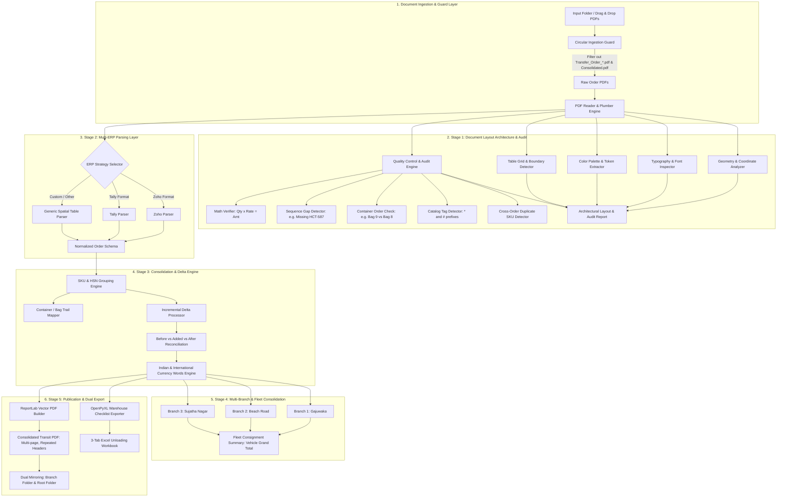

# System Architecture & Design Specification

## 1. System Overview & Core Mission

**PDF Consolidator** is an enterprise-grade document intelligence, layout analysis, and logistics consolidation platform designed to solve the real-world operational and regulatory disconnect between retail inventory preparation and physical vehicle transport.

In retail and multi-store distribution:
1. **Incremental Store Preparation**: Over several days, store associates pack merchandise into physical containers (bags, boxes, or cartons), generating individual transfer orders or delivery challans in POS/ERP systems (such as Zoho POS, Zoho Books, Tally, Busy, SAP, or Marg) as each container is sealed.
2. **Bulk Vehicle Movement**: All stock from multiple branches physically moves together in a single transport vehicle.
3. **Statutory Tax & Transit Compliance**: Under transport regulations (such as GST Rule 55 in India, e-Way bill consignment mandates, and transit checkpoints), transit documents must:
   - Carry the **actual vehicle movement date** (today's date).
   - Consolidate dozens of fragmented bag orders into a unified movement document per dispatching branch.
   - Maintain accurate Place of Supply and GSTIN matching.
   - Reconcile line item arithmetic without rounding drift.
4. **Unloading Verification**: Receiving store staff must retain a transparent container audit trail (which bag contains which items) during unpacking.
5. **Last-Minute Incremental Additions**: Ground staff frequently add late bags (e.g. +8 bags, +5 bags) right up until the truck departs. The platform must handle continuous incremental additions without manual re-entry.

---

## 2. End-to-End Processing Architecture



---

## 3. Modular Architecture Breakdown

### 3.1 `analyzer/` — Document Layout & Format Architecture Engine
* **`geometry.py`**: Auto-detects page size (A4, Letter), orientation, margin insets (top, bottom, left, right), and maps the 6 spatial layout zones.
* **`typography.py`**: Extracts embedded font families (Ubuntu, Helvetica), scales font sizes into a 6-tier hierarchy, and records font weights and leading.
* **`palette.py`**: Extracts exact vector fills (header bar `#3C3D3A`), border rules (`#ADADAD`, `#CCCCCC`), and text colors into design tokens.
* **`table_grid.py`**: Analyzes character coordinate bounding boxes to determine column boundaries, width percentages, and alignment (numeric right-aligned, text left-aligned).
* **`audit_checker.py`**: Comprehensive QC audit:
  * Verifies row-level math ($	ext{Qty} 	imes 	ext{Rate} = 	ext{Amount}$).
  * Checks order sequence continuity (flags gaps like missing `HCT-587`).
  * Checks container sequencing (flags out-of-order bag creations).
  * Detects catalog prefix tags (`*` and `#`).
  * Detects duplicate SKUs distributed across separate transfer orders.

### 3.2 `parsers/` — Multi-ERP Ingestion Layer
* **`guard.py` (Circular Ingestion Guard)**: Inspects filenames and metadata to strictly exclude previously generated outputs (`Transfer_Order_*.pdf`, `Consolidated.pdf`, `.xlsx`, temporary files), preventing circular duplication.
* **`base_parser.py`**: Abstract contract for ERP-specific parsers.
* **`zoho_parser.py`**: Optimized for Zoho Books, Zoho Inventory, and Zoho POS.
* **`tally_parser.py`**: Optimized for Tally Prime and Tally.ERP 9 stock transfer vouchers.
* **`generic_table_parser.py`**: Universal spatial table extractor using horizontal character clustering and whitespace boundary projection.

### 3.3 `consolidator/` — Grouping, Delta & Currency Engine
* **`item_grouper.py`**: Groups items by 3-tuple `(SKU, Cost Price, HSN)` while appending container references to an audit set.
* **`delta_processor.py`**: Handles incremental additions (e.g. +8 orders, +5 orders) by calculating the baseline, added delta, and updated total.
* **`currency_words.py`**: Translates monetary amounts into words with exact paise precision using Indian numbering (Crores, Lakhs, Thousands, Hundreds) and Western formats.

### 3.4 `fleet/` — Multi-Branch Fleet Management
* **`fleet_manager.py`**: Scans parent directories containing multiple branch subfolders (e.g. Gajuwaka, Beach Road, Sujatha Nagar), builds store-level unified transit documents, and compiles a unified **Master Fleet Vehicle Manifest** summarizing the entire consignment.

### 3.5 `generator/` — Publication & Dual Export Engine
* **`pdf_builder.py`**: ReportLab engine generating vector PDFs matching analyzed styling, with two-pass `NumberedCanvas` dynamic page numbering, repeated table headers on page breaks (`repeatRows=1`), brand logo placement, and orphan prevention.
* **`excel_exporter.py`**: OpenPyXL engine emitting a 3-tab warehouse unloading workbook (Consignment Summary, Master Product Checklist with check-off boxes, and Bag-by-Bag Unpacking Annexure).

---

## 4. Normalized Data Schema

Every ingested order is normalized into a standard JSON schema:

```json
{
  "order_metadata": {
    "source_system": "Zoho Inventory | Tally | Generic",
    "document_type": "Transfer Order | Delivery Challan",
    "original_order_id": "HCT-579",
    "original_date": "2026-09-19",
    "created_by": "B Sai Praveen",
    "place_of_supply": "Telangana (36)"
  },
  "parties": {
    "company": {
      "name": "Horizon Collections",
      "address": "K. V. Rangareddy Telangana 500070 India",
      "gstin": "36BAZPV7883C1ZO",
      "phone": "+91 833 299 0022",
      "email": "horizoncollection02@gmail.com",
      "website": "thehorizoncollections.com"
    },
    "source_location": {
      "name": "Gajuwaka Store",
      "address": "Visakhapatnam Andhra Pradesh 530026 India",
      "gstin": "37BAZPV7883C2ZL",
      "phone": "+918332990033",
      "website": "thehorizoncollections.com"
    },
    "destination_location": {
      "name": "Vanasthalipuram Store",
      "address": "K. V. Rangareddy Telangana 500070 India",
      "gstin": "36BAZPV7883C1ZO",
      "phone": "+91 833 299 0022",
      "website": "thehorizoncollections.com"
    }
  },
  "line_items": [
    {
      "item_index": 1,
      "description": "Alpha Pearl Border Peach Saree",
      "sku": "35659",
      "hsn_sac": "540754",
      "quantity": 10.0,
      "unit": "pcs",
      "cost_price": 499.0,
      "amount": 4990.0,
      "container_reference": "BAG - 1"
    }
  ],
  "totals": {
    "total_quantity": 10.0,
    "total_amount": 4990.0,
    "amount_in_words": "Indian Rupee Four Thousand Nine Hundred Ninety Only"
  },
  "dispatch_notes": {
    "reason": "GWK - VSPM BAG - 1"
  }
}
```\n