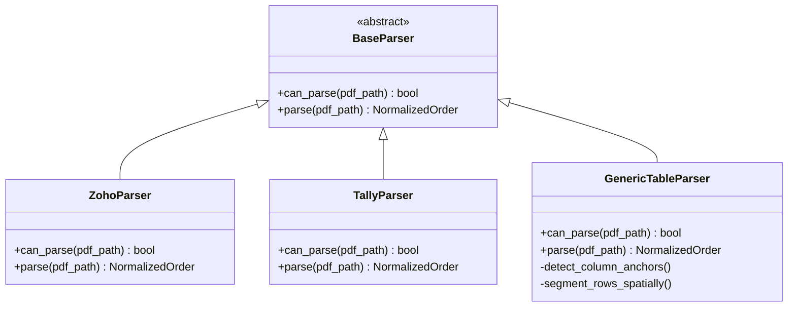

# Multi-ERP Parser & Ingestion Specification

## 1. Circular Ingestion Guard (`guard.py`)

A critical requirement in real-world retail dispatches is preventing **circular ingestion**:
When running consolidation scripts in a folder where consolidated outputs or temporary files already exist, the parser must strictly ignore generated files.

### Filtering Rules:
* Excludes any file starting with `Transfer_Order_*.pdf`.
* Excludes any file containing `Consolidated*.pdf`.
* Excludes `.xlsx`, `.csv`, `.tmp`, or hidden `.ini` files (e.g. `desktop.ini`).
* Matches only valid raw order files conforming to ERP naming schemes (e.g. `^HCT-\d+\.pdf$`).

---

## 2. Multi-ERP Parsing Architecture

---

## 3. Parser Specifications

### 3.1 `ZohoParser` (Zoho Books / Inventory / POS)
* **Metadata Signature**: `/Producer (OpenPDF ...)` or presence of `TransferOrder#` and `Place Of Supply:`.
* **Header Extraction**:
  * `order_id`: Regex `TransferOrder#\s*([A-Za-z0-9\-]+)`
  * `date`: Regex `Date\s*([0-9]{1,2}\s+[A-Za-z]+\s+[0-9]{4})`
  * `created_by`: Regex `Created By\s+([^\n]+)`
* **Location Cards**: Parses Source and Destination store name, address, GSTIN, phone, and website from the split card block.
* **Line Items**: Multi-line item parser extracting Index, Item Name, SKU, HSN, Quantity, Unit, Cost Price, and Amount.
* **Dispatch Notes**: Extracts Reason block (e.g., `GWK - VSPM BAG - 1` or `SN - VSPM BAG -79`).

### 3.2 `TallyParser` (Tally Prime / Tally.ERP 9)
* **Metadata Signature**: `Transfer of Materials`, `Source Godown`, `Destination Godown`.
* **Header Extraction**: Voucher Number, Transfer Date, Party/Company Name, GSTIN.
* **Line Items**: Multi-column table parsing for Description of Goods, HSN Code, Quantity, Rate, and Amount.

### 3.3 `GenericTableParser` (Universal Spatial Table Extraction)
* **Spatial Word Clustering**: Clusters text into words with bounding coordinates $(x_0, y_0, x_1, y_1)$.
* **Header Band Discovery**: Detects tabular header keywords (`#`, `Item`, `Description`, `HSN`, `Qty`, `Rate`, `Amount`).
* **Vertical Column Projection**: Projects vertical rays down the page to segment words into discrete columns without requiring visual border lines.
* **Heuristic Field Mapping**: Maps extracted columns to standard schema fields using fuzzy string matching.

---

## 4. Multi-Branch Fleet Directory Ingestion

In addition to single-folder processing, the ingestion engine supports **Fleet Ingestion**:
* Scans a parent movement directory (e.g. `G:\My Drive\THC\Documents\Transfer Orders`).
* Automatically identifies distinct branch subfolders (e.g. `Gajuwaka`, `Beach Road`, `Sujatha Nagar`).
* Processes each branch independently into a standardized unified document, and compiles a combined **Fleet Consignment Summary** across all branches.\n