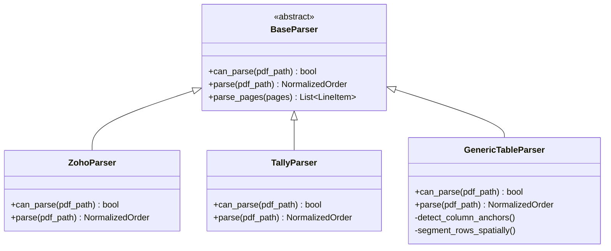

# Multi-ERP Parser & Ingestion Specification

## 1. Circular Ingestion Guard (`guard.py`)

A critical requirement in real-world retail dispatches is preventing **circular ingestion**:
When running consolidation scripts in a folder where consolidated outputs or temporary files already exist, the parser must strictly ignore generated files.

### Filtering Rules:
* Excludes any file starting with `Transfer_Order_*.pdf`.
* Excludes any file containing `Consolidated*.pdf`.
* Excludes `.xlsx`, `.csv`, `.tmp`, or hidden `.ini` files (e.g. `desktop.ini`).
* Matches only valid raw order files conforming to ERP naming schemes (e.g. `^HCT-\d+\.pdf$`).

---

## 2. Interactive Folder Selection & Cloud Hydration

### 2.1 Dynamic Folder Selection
In compliance with user privacy rules (excluding broad background access to parent drives like `G:\My Drive\THC`):
* **CLI**: Uses native OS file dialog (`tkinter.filedialog.askdirectory`) or CLI argument (`--input <path>`) to prompt the user to explicitly select the transfer orders folder.
* **Web UI**: Offers folder selection via HTML5 folder picker (`webkitdirectory`) or batch drag-and-drop.

### 2.2 Cloud-Drive File Hydration
On cloud-synced storage (Google Drive for Desktop, OneDrive):
* Files can exist as "On-demand" 0-byte stubs.
* `hydration.py` checks file size $> 0$, triggers on-demand read hydration, and retries up to 3 times before raising a file access warning.

---

## 3. Multi-Page Document Ingestion

Input transfer orders often span multiple pages if an individual bag contains 20+ line items:
* Every parser loops across all pages: `for page in pdf.pages:`.
* Line items are accumulated sequentially across page breaks.
* The header metadata is extracted from Page 1; totals, dispatch notes, and signatures are extracted from the final page.

---

## 4. Multi-ERP Parsing Architecture

---

## 5. Parser Specifications

### 5.1 `ZohoParser` (Zoho Books / Inventory / POS)
* **Metadata Signature**: `/Producer (OpenPDF ...)` or presence of `TransferOrder#` and `Place Of Supply:`.
* **Header Extraction**:
  * `order_id`: Regex `TransferOrder#\s*([A-Za-z0-9\-]+)`
  * `date`: Regex `Date\s*([0-9]{1,2}\s+[A-Za-z]+\s+[0-9]{4})`
  * `created_by`: Regex `Created By\s+([^\n]+)`
* **Location Cards**: Parses Source and Destination store name, address, GSTIN, phone, and website from the split card block.
* **Line Items**: Multi-line item parser extracting Index, Item Name, SKU, HSN, Quantity, Unit, Cost Price, and Amount.
* **Dispatch Notes**: Extracts Reason block (e.g., `GWK - VSPM BAG - 1` or `SN - VSPM BAG -79`).

### 5.2 `TallyParser` (Tally Prime / Tally.ERP 9)
* **Metadata Signature**: `Transfer of Materials`, `Source Godown`, `Destination Godown`.
* **Header Extraction**: Voucher Number, Transfer Date, Party/Company Name, GSTIN.
* **Line Items**: Multi-column table parsing for Description of Goods, HSN Code, Quantity, Rate, and Amount.

### 5.3 `GenericTableParser` (Universal Spatial Table Extraction)
* **Spatial Word Clustering**: Clusters text into words with bounding coordinates $(x_0, y_0, x_1, y_1)$.
* **Header Band Discovery**: Detects tabular header keywords (`#`, `Item`, `Description`, `HSN`, `Qty`, `Rate`, `Amount`).
* **Vertical Column Projection**: Projects vertical rays down the page to segment words into discrete columns without requiring visual border lines.
* **Heuristic Field Mapping**: Maps extracted columns to standard schema fields using fuzzy string matching.

### 5.4 `OCRFallback` (Scanned / Raster PDF Ingestion)
* Triggered when `len(page.chars) == 0`.
* Rasterizes PDF pages at 300 DPI using `pypdfium2` and extracts text and bounding boxes using OCR.\n